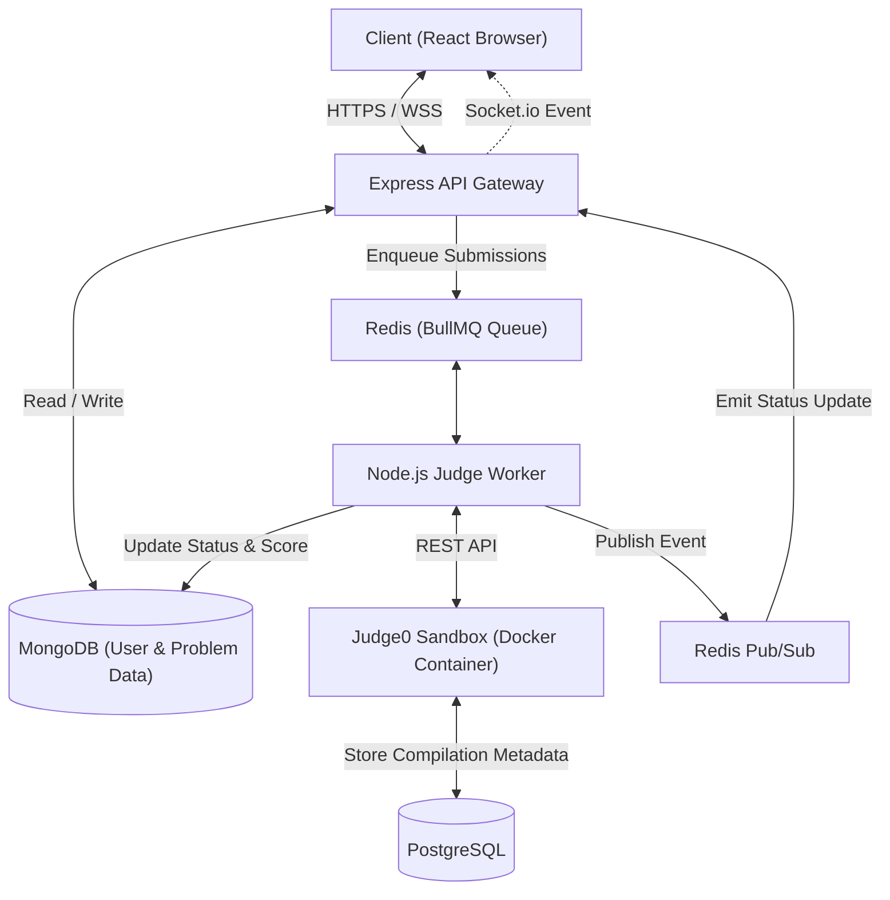

# 🚀 JudgeX: Enterprise-Grade Online Judge Platform

JudgeX is a highly scalable, containerized, queue-driven distributed Online Judge system modeled after modern coding platforms like LeetCode. It enables users to solve programming challenges in real-time, execute untrusted code securely inside sandboxed environments, participate in live contests, track rankings with dynamic leaderboards, and receive instant execution metrics.

Designed with a microservices-inspired architecture, JudgeX separates the high-traffic web API from the resource-intensive code execution layer using a robust job queue, cache buffers, and background workers.

---

## 🏗️ System Architecture & Workflow

JudgeX utilizes an asynchronous execution pipeline to ensure that slow compilations or heavy computations do not block web requests.



### The Submission Lifecycle
1. **Submit**: A user writes code in the Monaco Editor and clicks "Submit". The React frontend sends a POST request to the API Gateway.
2. **Queue**: The API Gateway authenticates the request, validates the input payload using schema validation (`Zod`), creates a pending `Submission` record in MongoDB, and enqueues a compilation task to the `submission-queue` in **Redis (BullMQ)**. It returns a `201 Created` response immediately.
3. **De-queue**: A dedicated **Node.js Worker** picks up the compilation task from the queue. It builds the code wrapper (injecting test harness wrappers if needed).
4. **Sandboxed Run**: The worker communicates with the **Judge0 Sandbox API** to execute the compiled code against multiple pre-defined `TestCases` in an isolated container environment, enforcing limits for execution time and memory usage.
5. **Score & Leaderboard**: If the submission is accepted and belongs to a live contest, the worker updates the contest score in MongoDB and publishes a message to a Redis Pub/Sub channel (`contest-score-updated`).
6. **Real-Time Push**: Upon completing all test cases, the worker saves the execution output (e.g., `Accepted`, `Wrong Answer`, `Time Limit Exceeded`, `Memory Limit Exceeded`) back to the database. The socket server (Socket.io) listens to updates and pushes the results in real-time directly to the user's active browser room.

---

## ✨ Core Features

- **💻 Multi-Language Monaco Code Editor**: Interactive code writing interface with code completion, syntax highlighting, theme options (dark/light), and support for multiple programming languages.
- **⚡ Asynchronous Queue-Based Evaluation**: Decoupled submission execution. Heavy load from concurrent submissions is cushioned by Redis/BullMQ to prevent system crashes.
- **🔒 Secure Sandboxed Code Execution**: Executes user-submitted code in an isolated sandbox powered by **Judge0**, shielding the host server from malicious scripts (e.g., infinite loops, unauthorized file system access, system calls).
- **📡 Real-Time Socket Updates**: Socket.io integration to display compilation logs and pass/fail states dynamically without requiring page refreshes.
- **🏆 Live Contest Engine**: Create, participate in, and manage programming contests with automated leaderboard scoring, penalty calculations, and ranking calculations.
- **🛡️ Schema Validation Layer**: Robust validation using `Zod` schemas at the API gateway layer to prevent malformed payloads, SQL injection, or schema corruption.
- **🔐 Enterprise Authentication & RBAC**: JWT-based authentication with cookie storage, secure password hashing (`bcrypt`), email verification, password reset, and role-based permissions (`admin` vs. `user`).

---

## 🛠️ Technology Stack

### Frontend
- **Framework**: React 19 (Vite)
- **Styling**: Tailwind CSS v4 (Modern, fast, next-gen styling engine)
- **Editor**: Monaco Editor (`@monaco-editor/react`)
- **Routing**: React Router DOM v7
- **Networking**: Axios

### Backend & API Gateway
- **Runtime**: Node.js (ES Modules)
- **Framework**: Express.js (v5.x)
- **Real-Time Engine**: Socket.io
- **Validation**: Zod (Type-safe input schema validation)
- **Authentication**: JWT & Cookie-Parser

### Worker & Queue
- **Task Scheduling**: BullMQ
- **Job Store / PubSub**: Redis

### Sandbox & Isolation
- **Execution Sandbox**: Judge0 CE (Community Edition)
- **Sandbox DB**: PostgreSQL 15 (For Judge0 internal metadata)

### Databases
- **Primary Datastore**: MongoDB (via Mongoose ODM)

---

## 📂 Project Structure

```text
JudgeX/
├── backend/
│   ├── index.js                     # Server entry point (http, sockets, DB init)
│   ├── app.js                       # Express app configuration & middleware
│   ├── config/                      # Database (Mongo) and Redis connections
│   ├── consumers/                   # Redis message queue consumers (Leaderboards)
│   ├── controllers/                 # Express controllers (Auth, Problems, Submissions, Contests)
│   ├── database/                    # Mongoose connection helpers
│   ├── middleware/                  # Auth, RBAC, and Zod validation middlewares
│   ├── queues/                      # BullMQ queue instantiations
│   ├── routes/                      # REST routes definition
│   ├── schema/                      # Mongoose schemas (User, Problem, Submission, TestCase)
│   ├── services/                    # Business logic (Judge0 API integration, Code building)
│   ├── socket/                      # Socket.io connection handlers
│   ├── validation/                  # Zod validation schemas (Auth, Contests, Submissions, etc.)
│   ├── worker/                      # Dedicated background worker processes
│   └── Dockerfile                   # Docker instruction for Node backend
├── frontend/
│   └── JudgeX/                      # React SPA
│       ├── public/                  # Static assets
│       ├── src/
│       │   ├── assets/              # Icons and images
│       │   ├── components/          # Reusable components (Navbar, Footer, Hero)
│       │   ├── context/             # Global React Contexts (Auth, Theme)
│       │   ├── Pages/               # Route pages (Home, Problems, Problem, Contests, Discuss)
│       │   ├── services/            # Axios API wrappers (api.js)
│       │   ├── App.jsx              # Main React component
│       │   └── main.jsx             # React entry point
│       └── vite.config.js           # Vite config
└── docker-compose.yml               # Multi-container orchestrator
```

---

## 🚀 Quick Start (Docker Compose - Recommended)

The simplest way to run the entire JudgeX platform (Backend, Frontend, Workers, Database, Redis, PostgreSQL, and Judge0 Sandbox) is using Docker Compose.

### 1. Clone & Set Environment Variables
Copy `.env.example` in the backend directory to `.env` and adjust the variables if needed.
```bash
cp backend/.env.example backend/.env
```

### 2. Run docker-compose
In the root directory of the project, execute:
```bash
docker-compose up --build
```
This command spins up:
- **MongoDB** on `mongodb://localhost:27017`
- **Redis** on `redis://localhost:6379`
- **PostgreSQL** on `localhost:5432` (Judge0 internal database)
- **Judge0 CE API** on `http://localhost:2358`
- **Express Backend** on `http://localhost:3000`
- **BullMQ Submission Worker**

### 3. Spin up Frontend
Navigate to the frontend directory and start the Vite development server:
```bash
cd frontend/JudgeX
npm install
npm run dev
```
Open `http://localhost:5173` in your browser.

---

## 🔧 Local Development (Manual Setup)

If you prefer to run services manually without Docker:

### Prerequisites
Ensure you have the following installed and running:
- **Node.js** (v18+)
- **MongoDB**
- **Redis**

### Step 1: Start Redis and MongoDB
Make sure your local Redis server and MongoDB services are running:
```bash
# Start Redis (Windows/macOS/Linux depending on installation)
redis-server

# Start MongoDB
mongod
```

### Step 2: Configure & Run Backend
1. Navigate to the backend directory and install dependencies:
   ```bash
   cd backend
   npm install
   ```
2. Configure your environment variables in `.env` (refer to [Environment Variables](#-environment-variables-reference) below).
3. Start the Express backend server (uses `nodemon` for hot reloading):
   ```bash
   npm run dev
   ```
4. Start the BullMQ Submission Worker in a separate terminal:
   ```bash
   npm run worker
   ```

### Step 3: Configure & Run Frontend
1. Navigate to the frontend app:
   ```bash
   cd ../frontend/JudgeX
   npm install
   ```
2. Start the development server:
   ```bash
   npm run dev
   ```

---

## 🔑 Environment Variables Reference

### Backend (`/backend/.env`)

| Variable | Description | Example / Default |
| :--- | :--- | :--- |
| `PORT` | Port for the Express server to listen on | `3000` |
| `MONGO_URI` | MongoDB connection string | `mongodb://localhost:27017/judgex` |
| `REDIS_HOST` | Redis host address | `localhost` |
| `REDIS_PORT` | Redis port | `6379` |
| `JWT_SECRET` | Secret key used for signing JWT tokens | `supersecretkey` |
| `MAIL_HOST` | SMTP server host for sending emails | `sandbox.smtp.mailtrap.io` |
| `MAIL_PORT` | SMTP server port | `587` |
| `MAIL_USERNAME` | SMTP server username | `smtp_username` |
| `MAIL_PASSWORD` | SMTP server password | `smtp_password` |
| `ADMIN_EMAIL` | Default administrator account email | `admin@judgex.com` |
| `ADMIN_PASSWORD` | Default administrator account password | `secureadminpass` |
| `BASE_URI` | Base URL of the API for redirects/email verification | `http://localhost:3000` |

---

## 📡 API Endpoints Summary

### Authentication & Profiles (`/api/v1/auth`)
| Method | Endpoint | Description | Access |
| :--- | :--- | :--- | :--- |
| `POST` | `/register` | Register a new user | Public |
| `POST` | `/login` | Log in user, returns cookie / JWT | Public |
| `POST` | `/logout` | Log out user, clears token cookie | Public |
| `GET` | `/verify/:verificationToken` | Verify email address | Public |
| `POST` | `/forgot-password` | Request password reset email | Public |
| `POST` | `/reset-password/:token` | Reset password | Public |
| `GET` | `/user` | Get current user's profile | Authenticated |
| `PUT` | `/user` | Update user profile | Authenticated |
| `POST` | `/admin` | Create a new Admin user | Admin Only |

### Problems Management (`/api/v1/problem`)
| Method | Endpoint | Description | Access |
| :--- | :--- | :--- | :--- |
| `POST` | `/create` | Create a coding problem | Admin Only |
| `GET` | `/all` | Get list of all problems (paginated) | Admin Only |
| `GET` | `/:slug` | Get details of a problem by slug | Public |
| `PATCH` | `/:id` | Update a problem | Admin Only |
| `DELETE` | `/:id` | Delete a problem | Admin Only |

### Test Cases (`/api/v1/testCase`)
| Method | Endpoint | Description | Access |
| :--- | :--- | :--- | :--- |
| `POST` | `/problem/:problemId` | Create a new test case for a problem | Admin Only |
| `GET` | `/problem/:problemId` | Get all test cases for a problem | Admin Only |
| `PUT` | `/:id` | Update a specific test case | Admin Only |
| `DELETE` | `/:id` | Delete a specific testcase | Admin Only |

### Submissions (`/api/v1/submission`)
| Method | Endpoint | Description | Access |
| :--- | :--- | :--- | :--- |
| `POST` | `/submit` | Submit code for valuation (adds to queue) | Authenticated |
| `GET` | `/my-submissions` | Get list of user's own submissions | Authenticated |
| `GET` | `/:id` | Retrieve submission status details | Authenticated |

### Contests Management (`/api/v1/contest`)
| Method | Endpoint | Description | Access |
| :--- | :--- | :--- | :--- |
| `POST` | `/create` | Create a new programming contest | Admin Only |
| `GET` | `/all` | Get list of all contests | Authenticated |
| `GET` | `/:id` | Get contest details by ID | Authenticated |
| `PUT` | `/:id` | Update contest configuration details | Admin Only |
| `DELETE` | `/:id` | Delete a contest | Admin Only |

### Contest Problems (`/api/v1/contestProblem`)
| Method | Endpoint | Description | Access |
| :--- | :--- | :--- | :--- |
| `POST` | `/:contestId/problems` | Add problem relation to contest | Admin Only |
| `GET` | `/:contestId/problems` | List problems in a specific contest | Admin Only |
| `PUT` | `/:contestId/problems/:problemId` | Update a problem config within a contest | Admin Only |
| `DELETE` | `/:contestId/problems/:problemId` | Remove problem from a contest | Admin Only |

### Contest Registrations (`/api/v1/contestRegister`)
| Method | Endpoint | Description | Access |
| :--- | :--- | :--- | :--- |
| `POST` | `/:contestId/register` | Register user for a contest | Authenticated |
| `GET` | `/:contestId/participants` | Get all participants registered to a contest | Admin Only |
| `GET` | `/:contestId/my-participations` | Check current user's contest enrollment | Authenticated |
| `GET` | `/:contestId/leaderboard` | View contest standings & leaderboard rankings | Authenticated |
| `GET` | `/:contestId/getRank` | Get current user's dynamic contest ranking | Authenticated |
| `DELETE` | `/:contestId/register` | Unregister user from a contest | Authenticated |

### Contest Submissions (`/api/v1/contestSubmission`)
| Method | Endpoint | Description | Access |
| :--- | :--- | :--- | :--- |
| `POST` | `/:contestId/:problemId/submit` | Submit code for a contest problem | Authenticated |
| `GET` | `/:contestId/Mysubmissions` | View own contest submissions | Authenticated |
| `GET` | `/:submissionId/submissionDetails`| Get details of a specific contest submission | Authenticated |

---

## 🔒 Security Practices

1. **Sandboxed Code Execution**: All user code executes inside ephemeral containers using `Judge0`. CPU time limits, memory limits, and process limits are strictly enforced. Network access inside the runtime sandbox is disabled.
2. **JWT-in-Cookie Auth**: Authentication tokens are stored securely in `httpOnly`, `sameSite: strict` cookies, shielding the application from Cross-Site Scripting (XSS) token theft.
3. **API Request Validation**: All incoming requests at REST endpoints are rigorously schema-checked and validated using `Zod` before database interaction.
4. **RBAC**: Sensitive resources (such as problem creation or user privileges) are guarded by middleware checking for `admin` role claims.

---

## 🤝 Contributing
1. Fork the project.
2. Create your feature branch (`git checkout -b feature/AmazingFeature`).
3. Commit your changes (`git commit -m 'Add some AmazingFeature'`).
4. Push to the branch (`git push origin feature/AmazingFeature`).
5. Open a Pull Request.
